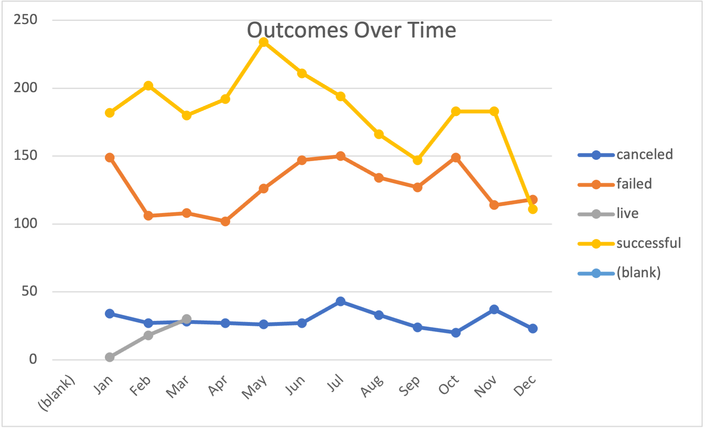
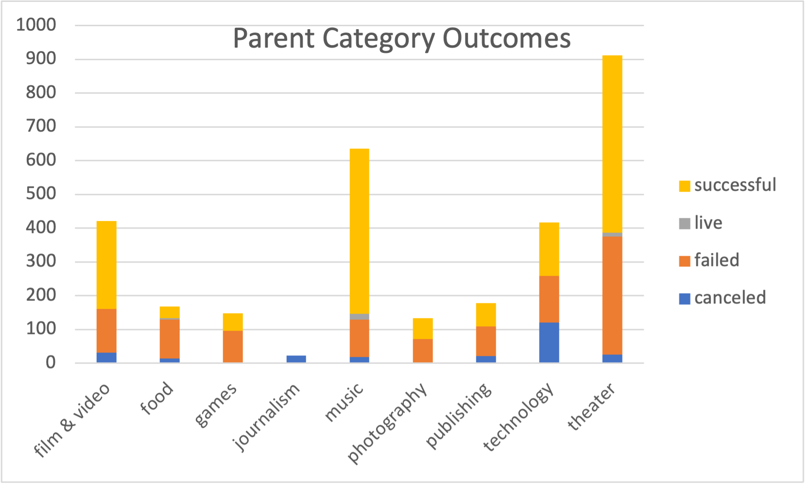
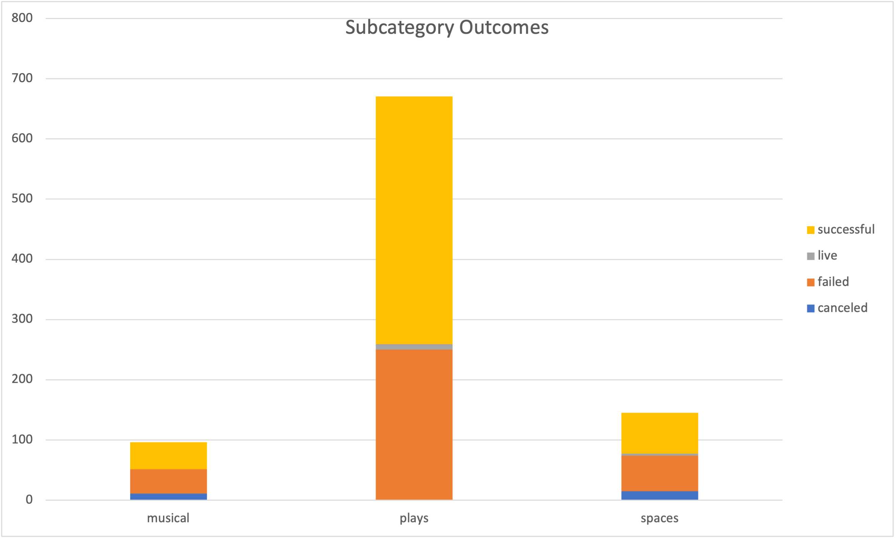

# An Analysis of Kickstarter Campaigns
This project was for a hopeful playwright, Louise, to better understand trends and outcomes for theater Kickstarter projects. I reviewed global and local projects Kickstarter data, filtered the focus to appropriate categories and subcategories, and used descriptive statistics to better understand the funding sources and amounts. This analysis uncovered trends to guide Louise as she plans her project.
## Results

## Recommendations
The average successful US kickstarter goal was $5,049 with $5,602 pledged. I recommend Louise lower her fundingt goal (originally $10,000) to $5,000.
👩‍💻
