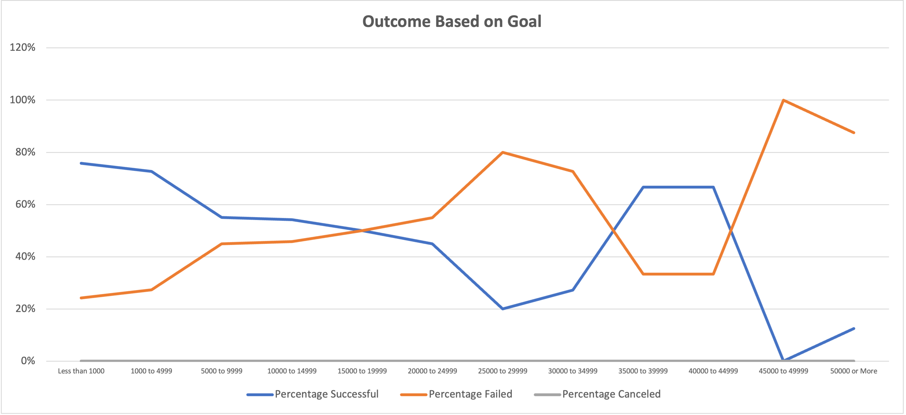

# Kickstarting with Excel

## Overview of Project
Playwright Louise wants to understand trends and outcomes for theater Kickstarter projects and has requested help analyzing the data. 
### Purpose
Louise is interested in Kickstarter campaigns specifically for theater projects, categorized as plays. She wants to understand the campaign outcome (successful, failed, or canceled) and it's relation to the campaign launch dates and funding goals. I used Kickstarter data filtered appropriate subcategory focus to uncover trends based on launch dates and funding goals.
## Analysis and Challenges
### Analysis of Outcomes Based on Launch Date

### Analysis of Outcomes Based on Goals

### Challenges and Difficulties Encountered

After building my graph for the Outcomes Based on Goal analysis, I quicky noticed my version did not match example. I realized something was off in my data, as I had much higher values. After re-reading the instructions and reviewing my formulas, I realized I failed to add a condition to my COUNTIFs formula, specifying to only count the item if the subcategory was "plays." Uncovering the issue took some time, but once I knew the error, it was simple to add the additional criteria to my already completed function. I built these formulas by typing the string in the first row for each item, copying down the columns, and adjusting each as needed. However, this was a manual way of calculating, and for a much larger data set, it may not be the best way to fix the error, as it could be time consuming.

## Results
- What are two conclusions you can draw about the Outcomes based on Launch Date?
- What can you conclude about the Outcomes based on Goals?
- What are some limiations of this dataset?
- What are some other possible tables and/or graphs that we could create?
