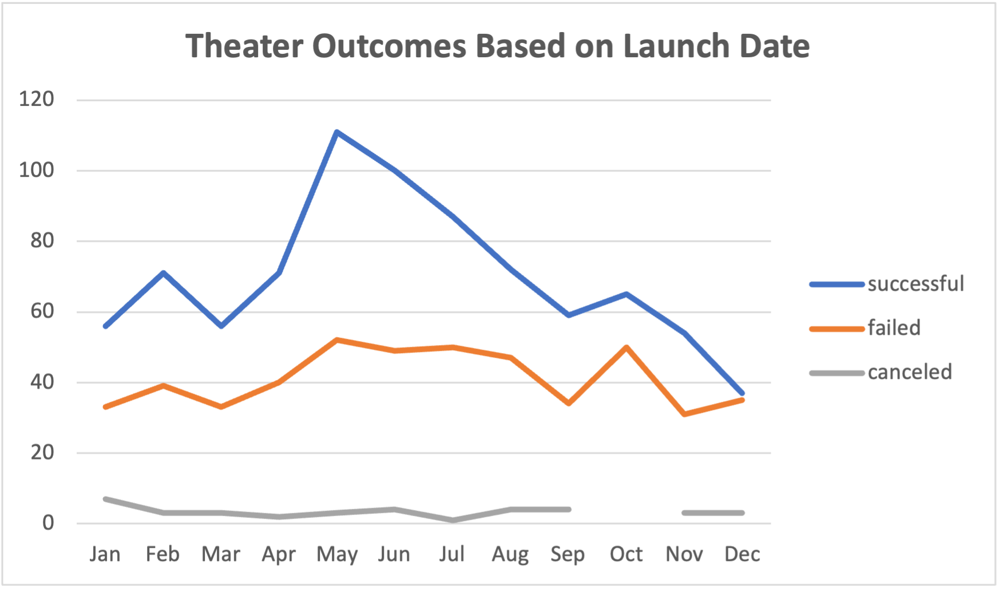

# Kickstarting with Excel

## Overview of Project
### Purpose
Playwright Louise wants to understand trends and outcomes for theater Kickstarter projects and has requested help analyzing the data. Louise is interested in Kickstarter campaigns specifically for theater projects that are also categorized as plays. She wants to understand the campaign outcome (successful, failed, or canceled) and its relation to the campaign launch dates and funding goals. I used Kickstarter data filtered to the appropriate subcategory focus to uncover trends based on launch dates and funding goals.
## Analysis and Challenges
### Analysis of Outcomes Based on Launch Date
To analyze the Kickstarter Campaign Outcome by Launch Date, I used the =YEAR function to select only the year from the Date Created into its own data column. I created a Pivot table with Year and Parent Category filters so I was only viewing the data related to the "theater" Parent Category. The Pivot table counted the number of campaigns for each outcome type considered (successful, failed, or canceled)

This line graph visually aggregates the number of campaigns by outcome. The month of May saw the highest number of successful outcomes, 111 campaigns. There are also spikes around the months of February and October for both successful and failed campaigns. The canceled campaigns has significantly less data points to analyze and there were no noticeable trends as it appears flat.
### Analysis of Outcomes Based on Goals
To analyze the campaign Outcome Based on the Funding Goals, I first created ranges to look at bands of Funding Goals to combine simliarly goaled campaigns together. Ex. < $1,000, $1,000-4,999, etc. I used the =COUNTIFs function to count the number of projects that met the funding dollar criteria for each outcome type. Once that step was complete, the counts were summed together and each outcome type was expressed as a percentage of the total for each funding range. 

As this graphical representation shows, the ratio of successful to failed campaigns varies across the bands. The plays subcategory was interesting compared to theater as a whole because there were no "Canceled" campaigns. This is represented as the gray line at 0 on the x-axis. That means the two remaining two categories, successful and failed should total 100% if summed at each range. Because this graph plots percentages on a line graph, the result is a mirror shape. If I were to draw an imaginary line at 50% half the data should be above the line and the other half should be below. On the lower end of the bands <$4,999 there was a much higher percentage of successful campaigns (the blue line is above the orange), where as on the highest end $45,000+ most campaigns failed. I was surprised to also see a high failure rate in the middle of the graph around the $25,000-29,999 band.
### Challenges and Difficulties Encountered

After building my graph for the Outcomes Based on Goal analysis, I quicky noticed my version did not match example. I realized something was off in my data, as I had much higher values. After re-reading the instructions and reviewing my formulas, I realized I failed to add a condition to my COUNTIFs formula, specifying to only count the item if the subcategory was "plays." Uncovering the issue took some time, but once I knew the error, it was simple to add the additional criteria to my already completed function. I built these formulas by typing the string in the first row for each item, copying down the columns, and adjusting each as needed. However, this was a manual way of calculating, and for a much larger data set, it may not be the best way to fix the error, as it could be time consuming.

## Results
- Reviewing the Outcomes based on Launch Date graph, it's clear the summer months (April, May, and June) tend to have the highest number of successful campaigns. The failed campaigns also had some high and low points, but overall the failed campaigns did not have a wide range of variance. This leads me to think the Launch Date is not necessarily indicitve of failure, and perhaps there's another criteria or relationship causing the spike in successes in the summer months. An analysis of those specific campaigns, looking at other data points like the number of backers, the staff pick criteria, funding goal, or geo could reveal more correlations to success. When looking at the Outcomes based on Launch Date, it's important to note this is looking at all campaigns over all time. Using the year filter could give more granular detail, and looking at the past 2-3 years could paint a more recent and relevant picture of the current state.
- The Outcomes Based on Goals shows the plays category typically does not have many canceled kickstarter campaigns and overall there are more successes than failures. That said, there are certain funding goals that trend more successful: Less than $4,999 and $35,000-44,900. I would recommend Louise set a funding goal in these ranges.
-The most recent data in this data set is from 2017, almost five years old. More recent data could paint a more accurate picture of the kickstarter successes and take into account more of the global and macro level impacts to business and crowdfunding in the past few years (global pandemics, political conflicts, etc.)
-There are other ways we could look at this data to draw conclusions. Since the data around plays is a small subset of the larger dataset, it could be interesting to compare Outcomes Based on Goal for other categories in the theater group to see if there are any other correlations. Overall I would recommend to Louise to minfully select a kickstarter funding goal in the successful range for her category and to consider launching in a peak summer month, but to remember the correlation does not necessarily mean causation. 
